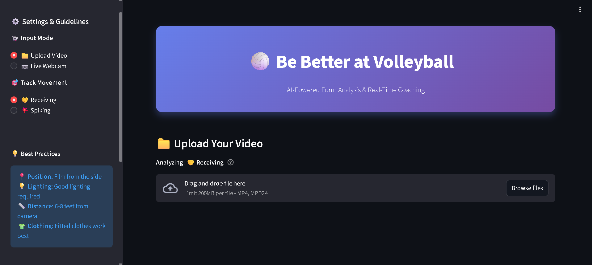

# 🏐 BeBetterAtVolleyball

Welcome to **BeBetterAtVolleyball** – your AI-powered assistant for improving your volleyball passing and receiving technique! This project analyzes your volleyball form using computer vision and provides actionable, real-time feedback to help you perfect your passes.

---

## 📹 What does it do?



- **Upload a video** or **use your webcam** to record yourself performing a volleyball receive.
- The app uses **MediaPipe** pose estimation to track your movements.
- It analyzes key angles (knees, arms, back) and **highlights corrections** you can make for better form.
- **Visual feedback** is drawn directly on your video, with volleyball-themed colors and suggestions.

---

## 🏐 Features

- **Dual-Mode Skill Analysis**: Choose between **Receiving** and **Spiking** form analysis
- **Real-time posture analysis** with AI-powered coaching
- **Skill-Specific Feedback**: 
  - **Receiving**: Knee bend, back angle, arm extension
  - **Spiking**: Arm height, arm extension, approach power
- **Live Metrics & Performance Rating**: Track your form with real-time calculations
- **Streamlit interface** for a simple and interactive experience
- **Upload or live webcam support** for training anywhere
- **Professional UI** with metric cards and visual style

---

## 🌐 Try It Online

**No setup required!** Try the app right now:

👉 **[https://volley-analyzer.onrender.com](https://volley-analyzer.onrender.com)**

Simply visit the link, upload a video or use your webcam, and get instant feedback on your form!

---

## 🚀 Getting Started

### 1. Clone the repo

```bash
git clone https://github.com/CouchPtato/BeBetterAtVolleyball.git
cd BeBetterAtVolleyball
```

### 2. Install requirements

```bash
pip install -r requirements.txt
```

### 3. Run the app

```bash
streamlit run App.py
```

### 4. Use the app

- Select your **Input Mode**: Upload a pre-recorded video or use your webcam
- Choose your **Skill Type**: 
  - **Receiving** (🤝): Analyze your receive/pass form
  - **Spiking** (💥): Analyze your spiking technique
- Review the **Form Standards** in the sidebar to understand correct form
- For best results, film yourself **from the side** in good lighting

---

## 🖥️ Demo


---

## 🛠️ Tech Stack

- **Python**
- [Streamlit](https://streamlit.io/) for the web interface
- [OpenCV](https://opencv.org/) for image processing
- [MediaPipe](https://google.github.io/mediapipe/) for pose estimation
- **NumPy**, **collections** for calculations and data handling

### General Process
- **Pose Detection**: Uses MediaPipe to detect 33 body landmarks in real-time
- **Angle Calculation**: Computes key angles (knees, arms, back, shoulders)
- **Smoothing**: Applies a 15-frame buffer to reduce jitter and provide stable metrics
- **Performance Rating**: Grades overall form as Excellent, Good, Needs Work, or Poor

### Receiving Analysis
- **Knee Bend**: Optimal range 90-120° for stability and power
- **Back Angle**: Lean forward 30°+ for better positioning
- **Arm Extension**: Keep arms extended 150°+ for maximum reach

### Spiking Analysis
- **Arm Height**: Raise elbows above shoulder level for maximum reach
- **Arm Extension**: Full arm extension (120°+) for power
- **Knee Bend**: Lower values (130°-) for explosive jump approach

### Visual Feedback
- Skeleton joints highlighted in **green** (good form) or **red** (needs improvement)
- Real-time metrics displayed alongside video feed
- Performance rating with emoji indicators
- Calculates angles for knees, arms, and back.
- Uses a buffer to smooth out angle calculations.
- Provides volleyball-specific feedback (e.g., "Bend knees more", "Straighten arms").
- Highlights the body parts that need correction in red.

---

## 🤝 Contributing

Pull requests are welcome! If you have ideas for more volleyball drills, better pose estimation, or UI improvements, please open an issue or submit a PR.

---

## 📧 Contact

Questions or feedback? Open an issue or reach out to [CouchPtato](https://github.com/CouchPtato).

---

## 🏆 Let's get you ready for your next game – one perfect pass at a time!