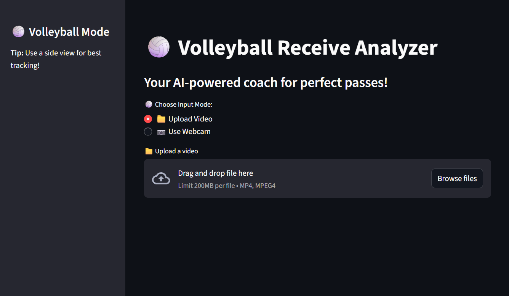

# 🏐 BeBetterAtVolleyball

Welcome to **BeBetterAtVolleyball** – your AI-powered assistant for improving your volleyball passing and receiving technique! This project analyzes your volleyball form using computer vision and provides actionable, real-time feedback to help you perfect your passes.

---

## 📹 What does it do?



- **Upload a video** or **use your webcam** to record yourself performing a volleyball receive.
- The app uses **MediaPipe** pose estimation to track your movements.
- It analyzes key angles (knees, arms, back) and **highlights corrections** you can make for better form.
- **Visual feedback** is drawn directly on your video, with volleyball-themed colors and suggestions.

---

## 🏐 Features

- **Real-time posture analysis** for volleyball passing
- **Feedback highlights**: Bend knees, straighten arms, lean forward, etc.
- **Streamlit interface** for a simple and interactive experience
- **Upload or live webcam support**
- **Volleyball colors and visuals** throughout the app

---

## 🚀 Getting Started

### 1. Clone the repo

```bash
git clone https://github.com/CouchPtato/BeBetterAtVolleyball.git
cd BeBetterAtVolleyball
```

### 2. Install requirements

```bash
pip install -r requirements.txt
```

### 3. Run the app

```bash
streamlit run App.py
```

### 4. Use the app

- Choose **Upload Video** to analyze a pre-recorded video, or **Use Webcam** for live feedback.
- For best results, film yourself from the side while receiving/passing a volleyball.

---

## 🖥️ Demo


---

## 🛠️ Tech Stack

- **Python**
- [Streamlit](https://streamlit.io/) for the web interface
- [OpenCV](https://opencv.org/) for image processing
- [MediaPipe](https://google.github.io/mediapipe/) for pose estimation
- **NumPy**, **collections** for calculations and data handling

---

## 📄 How it works

- Detects body landmarks with MediaPipe.
- Calculates angles for knees, arms, and back.
- Uses a buffer to smooth out angle calculations.
- Provides volleyball-specific feedback (e.g., "Bend knees more", "Straighten arms").
- Highlights the body parts that need correction in red.

---

## 🤝 Contributing

Pull requests are welcome! If you have ideas for more volleyball drills, better pose estimation, or UI improvements, please open an issue or submit a PR.

---

## 📧 Contact

Questions or feedback? Open an issue or reach out to [CouchPtato](https://github.com/CouchPtato).

---

## 🏆 Let's get you ready for your next game – one perfect pass at a time!